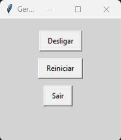

# 🔄 Gerenciador de Energia

Este é um pequeno aplicativo desenvolvido em Python usando Tkinter que permite desligar, reiniciar ou fazer logout do sistema operacional Windows por meio de uma interface gráfica.

## 📌 Funcionalidades
- **Desligar** o computador com um clique.
- **Reiniciar** o sistema de forma rápida.
- **Fazer logout** da sessão atual.
- **Janela centralizada** na tela automaticamente.

## 🛠️ Tecnologias Utilizadas
- Python
- Tkinter (interface gráfica)
- OS (comandos do sistema)

## 🚀 Como Executar
1. Certifique-se de ter o Python instalado na sua máquina.
2. Baixe ou clone este repositório.
3. Execute o script com o seguinte comando:
   ```sh
   python nome_do_arquivo.py
   ```

⚠️ **Observação:** Este programa foi desenvolvido para funcionar em **Windows**, pois utiliza comandos específicos do sistema operacional para desligamento e reinicialização.

## 📷 Captura de Tela


## 📌 Melhorias Futuras
- Adicionar suporte para outros sistemas operacionais.
- Criar um layout mais moderno utilizando `ttk`.
- Adicionar um temporizador para ações programadas.

## 📜 Licença
Este projeto está sob a licença MIT. Sinta-se à vontade para modificar e distribuir.
